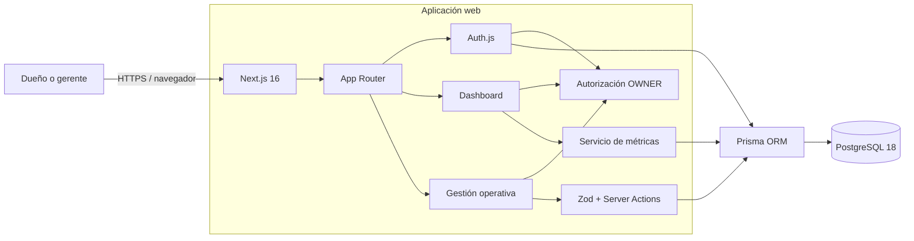
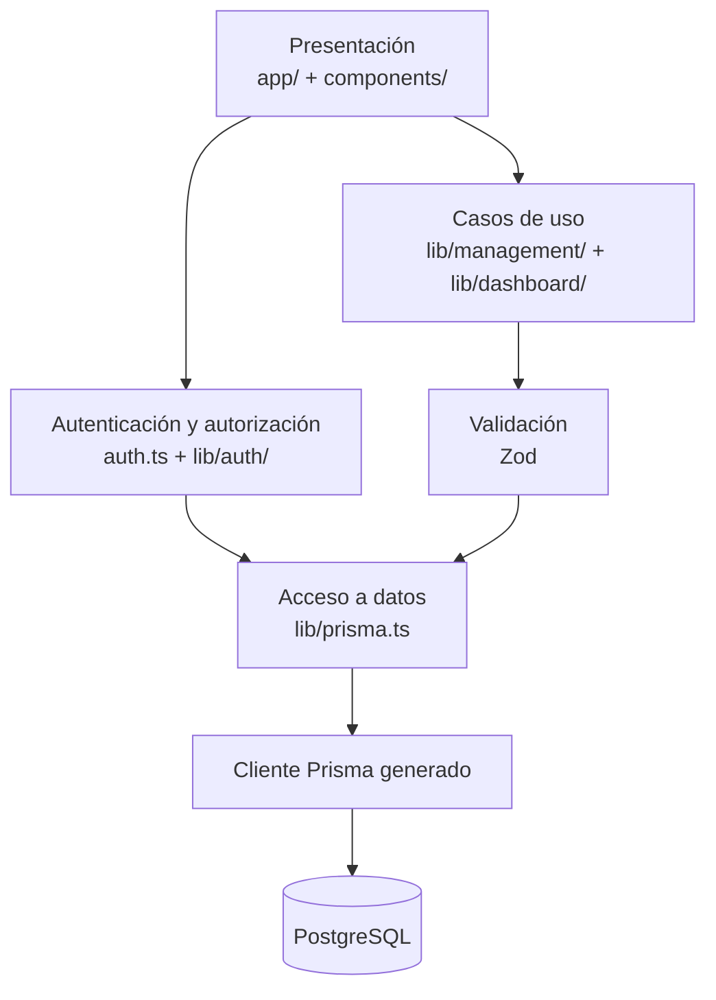
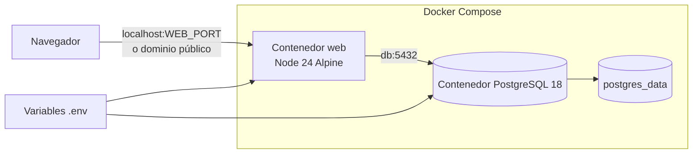
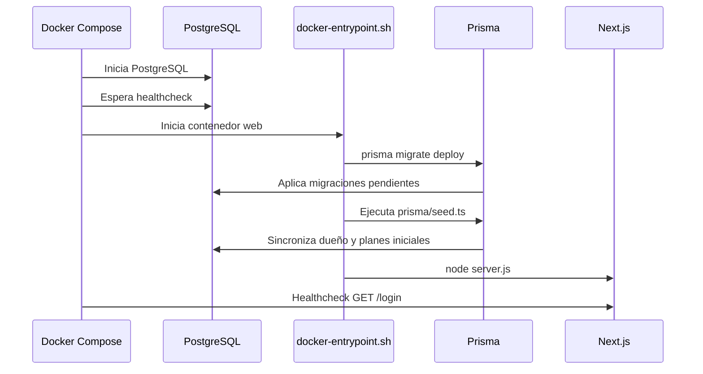
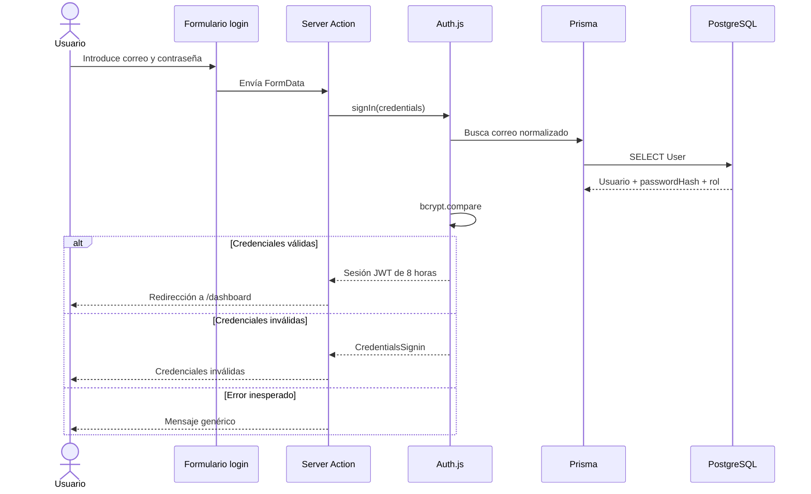
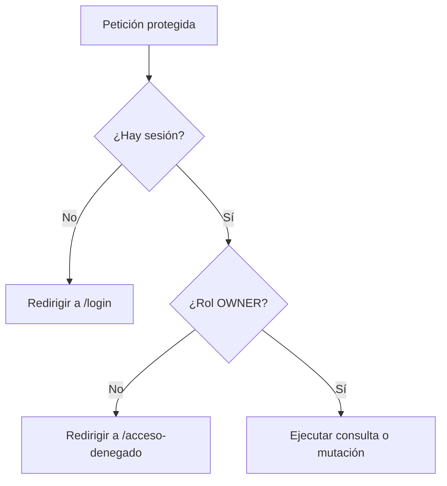
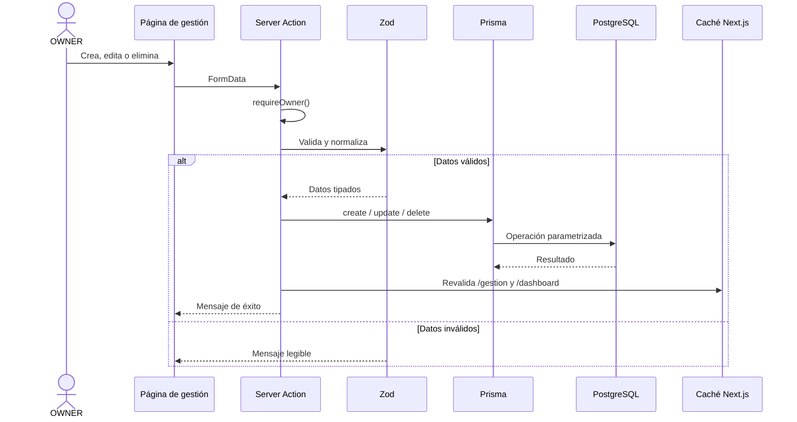
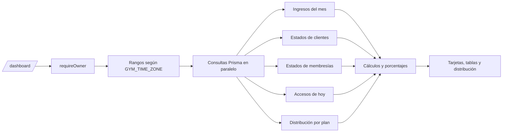
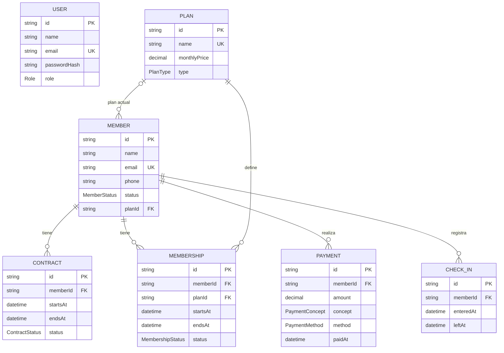

# Arquitectura y funcionamiento

Este documento describe la arquitectura implementada actualmente en Fuerza Total.

## Vista general



La aplicación es un monolito modular de Next.js. La interfaz, las Server Actions, la autenticación y las consultas de negocio se despliegan juntas; PostgreSQL es el único servicio de persistencia.

## Capas



| Capa | Responsabilidad |
| --- | --- |
| `app/` | Rutas, layouts, páginas y Server Actions del App Router. |
| `components/` | Componentes visuales reutilizables del dashboard y CRUD. |
| `lib/auth/` | Verificación de credenciales y autorización por rol. |
| `lib/management/` | Validación y mutaciones de gestión operativa. |
| `lib/dashboard/` | Rangos temporales, consultas y cálculo de métricas. |
| `lib/prisma.ts` | Instancia de Prisma conectada mediante `DATABASE_URL`. |
| `prisma/` | Esquema, migraciones y datos iniciales. |

## Despliegue



El puerto de PostgreSQL solo se publica en `127.0.0.1`. El puerto web también se limita a localhost en la configuración actual; un despliegue público requiere un proxy inverso o cambiar explícitamente el enlace de red.

### Arranque del contenedor web



El seed usa `upsert`: recrear el servicio web actualiza el hash de contraseña del correo configurado en `SEED_OWNER_EMAIL` sin duplicar ese usuario.

## Autenticación y autorización



El JWT contiene el identificador y el rol. `requireOwner()` protege el dashboard, el layout de gestión y cada mutación:



## Gestión operativa



Las entidades gestionadas son empleados (`User`), clientes (`Member`), contratos, membresías, pagos y accesos. Las contraseñas se almacenan como hashes bcrypt; nunca se devuelve el hash a la interfaz.

## Dashboard



Todas las métricas proceden de datos persistidos. Las consultas independientes se ejecutan en paralelo para reducir la latencia de renderizado.

## Modelo de datos



`User` representa empleados autenticables y no está relacionado todavía con clientes asignados. Ese vínculo pertenece al futuro dashboard del entrenador.

## Seguridad y configuración

- Los secretos solo se inyectan mediante variables de entorno; `.env` está ignorado por Git.
- `AUTH_URL` debe coincidir con la URL pública de producción.
- `AUTH_TRUST_HOST=true` permite operar detrás de Docker o un proxy inverso; el proxy debe sobrescribir encabezados del cliente y aceptar tráfico solo de infraestructura confiable.
- Las credenciales inválidas no revelan si existe el correo.
- Zod valida las entradas antes de acceder a Prisma.
- Prisma parametriza las operaciones SQL.
- Las restricciones de PostgreSQL impiden eliminar pagos, contratos o planes cuando la relación usa `Restrict`.

## Directorios principales

```text
app/                 Rutas y páginas Next.js
components/          Componentes de interfaz
lib/auth/            Autenticación y autorización
lib/dashboard/       Métricas gerenciales
lib/management/      Server Actions del CRUD
prisma/              Esquema, migraciones y seed
constitution/        Reglas estables del proyecto
features/            Especificaciones por funcionalidad
docs/                Documentación técnica
```
